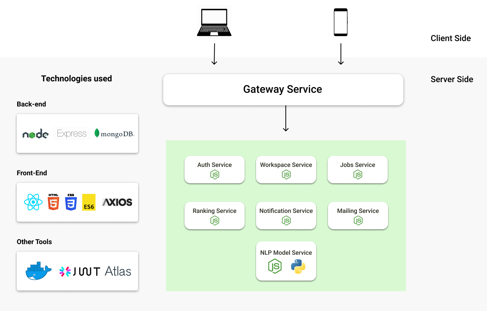
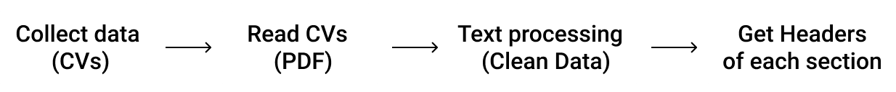
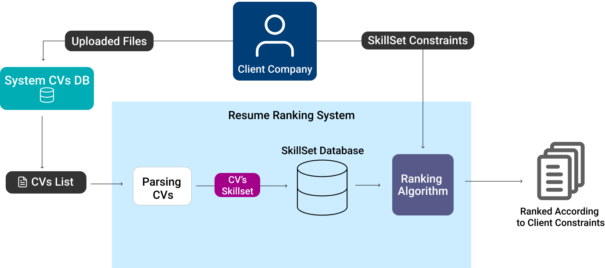

# RankUp web app

#### Problem definition

Choosing the right person to hire for a job isn’t easy, especially if there’s a large number of People applying for it. It requires to go through a lot of names who aren’t qualified and probably applied in the wrong department. The current recruitment process is more time consuming and requires more man power. It can take the HR a lot of time and effort to go through all the applicants’ CVs

#### So How we solved this problem?

We want to automate that filtering process so, there would be less manual interaction. We achieved this by creating a website “Rank Up” which allows the client to create a workspace and upload the resumes that needs to be ranked according to the job requirements he sets. Then as an output a list of candidates is displayed with the higher score candidates are on the top.

#### Not clear yet? don't worry here's a small demo of how it works

#### Software Architecture

	

#### NLP and Machine learning Model

##### Basic Steps

##### The full model architecture

